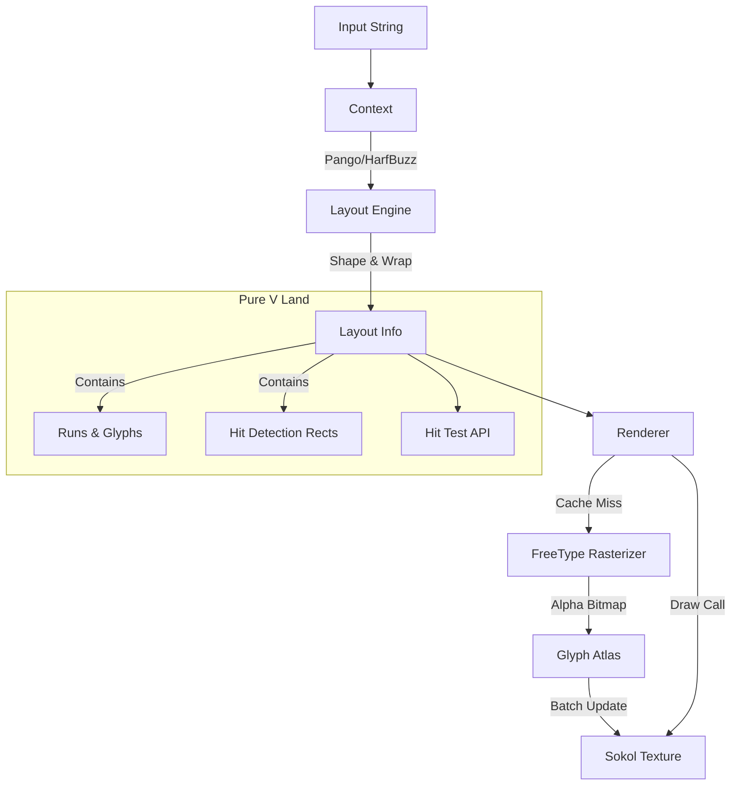

# vglyph Architecture

The system is designed to decouple **Text Layout** from **Text Rendering**. This
separation allows for efficient hit-testing and layout calculations without
separation allows for efficient hit-testing and layout calculations without
needing an active graphics context, and batched rendering for high performance.

## External Dependencies

vglyph leverages several industry-standard libraries to handle the complexities
of modern text:

*   **FreeType**: The industry-standard font rasterizer. It handles the low-level
    math of converting vector font outlines (TrueType, OpenType) into pixels.
*   **HarfBuzz**: The world's most popular text-shaping engine. It takes a string
    of Unicode characters and determines which glyphs to use and where precisely
    to position them.
*   **Pango**: A high-level layout library. It sits on top of HarfBuzz and
    FreeType to handle complex tasks like line breaking, bidirectional text
    (RTL/LTR), and mixed-font styling.

## Data Flow

## Key Components

1.  **Context (`vglyph.Context`)**:
    - Manages the connection to Pango and FontConfig.
    - Responsible for the heavy lifting of text shaping, wrapping, and laying
      out.
    - Produces a `Layout` object.

2.  **Layout (`vglyph.Layout`)**:
    - A lightweight, pure V struct containing all necessary information to draw
      text or perform hit tests.
    - Stores text as "Runs" (`Item`), which contain shaped "Glyphs".
    - Stores "Baked" Character Rectangles (`CharRect`) for O(1) or O(N) hit
      testing without querying Pango again.

3.  **Renderer (`vglyph.Renderer`)**:
    - Manages the `GlyphAtlas` (dynamic texture packing) and Glyph Cache.
    - Renders `Layout` objects to the screen using Sokol `gg`.
    - Handles color tinting and texture coordinates.

4.  **Glyph Atlas**:
    - Dynamically packs grayscale bitmaps of glyphs into a single GPU texture.
    - Uses a "dirty" flag system to batch uploads, ensuring only one
      `sg_update_image` call per frame (sokol requirement).
    - Supports dynamic resizing (growth). When the atlas fills up, it doubles in
      height. Old textures are kept alive ("garbage collected") until the start
      of the next frame to prevent crashing active draw calls in the render
      pipeline.

## Comparison with Other Engines

vGlyph prioritizes correctness and typographic quality over zero-dependency portability.

### 1. Architecture & Foundation
*   **vGlyph**: NOT a "from-scratch" layout engine. Binds to **Pango** (layout), **HarfBuzz** (shaping), and **FreeType** (rasterization). Inherits browser-grade complex script support.
*   **stb_truetype / simple engines**: Often use simple "font baking" (one character at a time). Fail at complex shaping (Arabic, ligatures).
*   **CoreText / DirectWrite**: Similar features, but vGlyph achieves cross-platform consistency by bundling its own stack rather than relying on OS APIs.

### 2. Shaping & Layout Capabilities
*   **Complex Scripts**: Natively supports hanging indents, soft hyphens, and mixed LTR/RTL paragraphs via Pango.
*   **Rich Text**: Persistent logic for rich text (colors, styles, fonts) with correct line-wrapping.
*   **Fallbacks**: Robust font fallback logic (e.g., automatic switch to Japanese or Emoji fonts).

### 3. Rendering Techniques
*   **Dynamic Atlas**: Uses a dynamic texture atlas, rasterizing glyphs on-the-fly and handling growth automatically.
*   **Subpixel Positioning**: Snaps to 1/4 pixel bins to prevent "jittering" in animations.
*   **Gamma Correction**: Software-side gamma correction (enhancing stem darkness) to match native macOS rendering.

### 4. Performance Strategy
*   **Layout Caching**: Robust LRU cache for text layouts makes measurement and hit-testing fast.
*   **Batched Draw Calls**: Integrates with `sokol` to batch text into efficient draw calls.
*   **Lazy Loading**: Glyphs rasterized/uploaded only when they appear on screen.

### 5. Trade-offs
*   **Pros**: Browser-grade text rendering (ligatures, emojis, kerning) in a lightweight V API.
*   **Cons**: Heavy external dependencies (Pango/Cairo/Glib). Harder distribution compared to pure-V or single-header libraries.

## Technical Nuances & Discrepancies

### Logical vs. Ink Rectangles (Hit Testing vs. Rendering)
You may observe that certain characters (especially Emojis or script fonts with
large swashes) render outside their hit-test rectangle.

*   **Logical Rectangle (Hit Test)**: This is the typographic "cell" determined
    by Pango. It ensures consistent line spacing and cursor placement. The
    `Layout.hit_test()` method uses these bounds.
*   **Ink Rectangle (Visual)**: This is the actual bounding box of the pixels
    drawn. FreeType respects the font's vertical bearings (`bitmap_top`),
    allowing glyphs to "bleed" out of their logical line height.

**This is intentional behavior.** It allows for tall emojis to appear native
without forcing the entire line of text to have varying or excessive height,
preserving the rhythm of the paragraph.

### Coordinate Systems
*   **Pango Units**: Internally, Pango uses integers scaled by 1024
    (`PANGO_SCALE`). The `Layout` struct normalizes these to standard
    floating-point pixels (`f32`) for the user.
*   **RTL Text**: For Right-to-Left languages, Pango may return negative width
    extents to indicate directionality. The library automatically normalizes
    these into standard positive-width rectangles during the "baking" phase of
    the layout.

### Rendering Cycle
To satisfy Sokol's requirement of a single texture update per frame, the
Renderer separates **Draw** calls from **Commit** calls.

1.  `draw_layout(...)`: Queues quads and loads new glyphs into the CPU-side
    atlas if needed.
2.  `commit()`: Must be called **once** at the end of the frame to upload any
    new glyph data to the GPU. Not calling this will result in invisible text
    for newly loaded characters.
